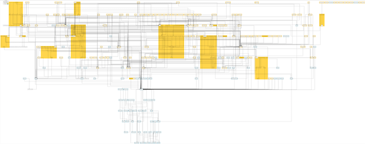
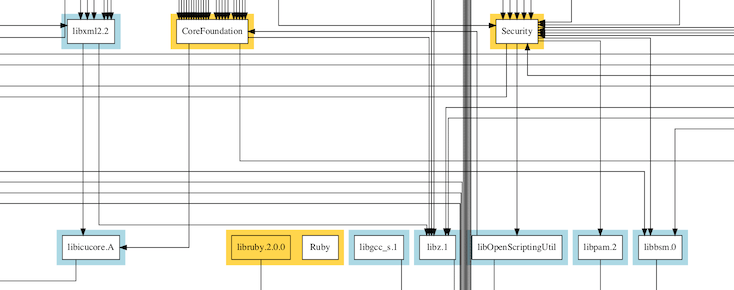

# osx_frameworks
Generate a .dot file of OS X frameworks dependencies

    python osx_frameworks.py Tests
    python osx_frameworks.py > osx.dot
    dot -Tpdf osx.dot -o osx.pdf && open osx.pdf
    dot -Tpng osx.dot -o osx.png && open osx.png

